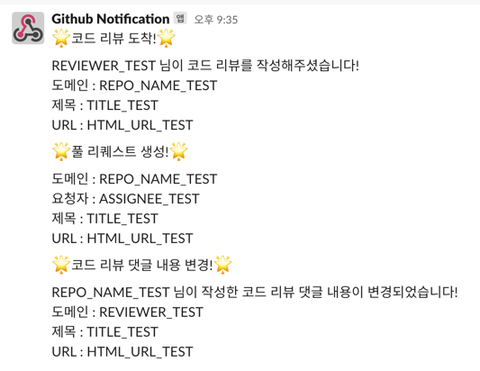

# webhook-event-receiver
kotlin1.7, SpringBoot 3.1, hexagonal architecture를 이용한 웹훅 리시버 시스템

---

### 목차

 * [개발환경](#개발환경)
 * [사용방법](#사용방법)
 * [작업예정](#작업예정)

---

### 개발환경

1. BE
    * kotlin 1.7
    * Spring boot 3.0.1
    * gradle
    * webflux
2. DOCS
    * javadoc
3. ARCHITECTURE
    * DDD
    * hexagonal

---

### 사용방법

1. github repository에 webhook 설정
   * repo > settings > Code and automation > Webhooks > "Add webhook" 버튼 클릭
   * Payload URL: 배포URL "{domain}/api/github/{channel}"
     * domain : 배포한 URL
     * channel : 현재 slack notification만 구현함 (추후 추가예정)
   * Content type: application/json
   * "Let me select indiviudal events" 라디오버튼 선택 (현재 구현된 webhook은 아래와 같다)
     * Pull requests
     * Pull request reviews
     * Pull request review comments
     * Issue comments
   * 맨 아래 "Add webhook" 녹색버튼 클릭
2. 테스트
   * webhook 이벤트를 설정한 repository에서 설정한 이벤트 발생시 Slack채널을 통해 알림 발송
   * 슬랙채널은 테스트용 채널로 설정

---

### 작업예정

1. 채널 다양화
   * 현재는 Slack만 가능하나 카톡알림,email,텔레그램 추가 예정
2. 이벤트 다양화
   * 현재는 github만 가능하나 grafana, dockerhub 웹훅 추가 예정